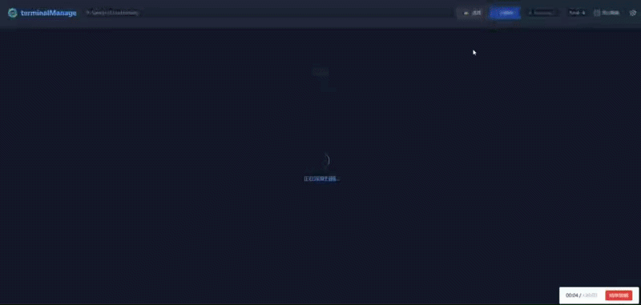

<div align="center">
  
  <h1>terminalManage</h1>
  <p>
    <b>新一代跨平台开发管理工具</b>
  </p>
  <p>
    基于 Electron 33 + Vue 3 + Express 5 构建，专为前端开发者打造的高效本地工作台。
  </p>

  <a href="https://github.com/WEBNSNM/dev-manage/actions">
    
  </a>
  
  
  
  

  <br><br>

  [下载最新版本](https://github.com/WEBNSNM/dev-manage/releases/latest) · [报告 Bug](https://github.com/WEBNSNM/dev-manage/issues)
</div>

---

## 项目简介

**terminalManage** 是一个面向前端开发者的桌面端项目管理工具。当你同时维护十几个甚至几十个本地项目时，terminalManage 让你告别在文件夹和终端之间反复跳转的痛苦——一个界面统一管理项目脚本启动、临时命令执行、监控、日志查看、Git 提交和 Node 版本切换。

<div align="center">


</div>

---

## 核心功能

### 🔍 智能项目扫描

选择一个工作目录，terminalManage 自动递归扫描所有包含 `package.json` 的项目（深度 4 层），并识别每个项目使用的包管理器（npm / pnpm / yarn）。扫描结果以卡片网格形式展示，支持隐藏不需要关注的项目。

### ▶️ 一键脚本执行

自动读取每个项目 `package.json` 中的 `scripts`，以按钮形式展示。点击即可启动，运行中的脚本以绿色高亮标识，支持一键 KILL 强制终止进程（包含子进程树）。

### ⌨️ 项目级临时命令

每个项目卡片都带有独立的命令输入区，可直接执行 `npm i`、`pnpm add xxx`、`node -v` 等临时命令：

- 在项目根目录执行，不需要额外打开系统终端
- 输出直接进入当前项目的内嵌终端日志，并带 `[command]` 前缀
- 支持单独停止，不影响已有脚本运行状态
- 执行时会复用当前项目选择的 Node 版本

### 📊 实时进程监控

脚本启动后，terminalManage 每 2 秒采集一次进程资源数据，**聚合父子进程**（如 npm → node → vite）的 CPU 和内存占用，以可视化进度条实时展示在项目卡片中。

### 📟 内嵌终端日志

基于 xterm.js 的终端视图，实时展示脚本输出。支持：
- ANSI 颜色渲染，还原真实终端效果
- 日志复制、一键清空
- 文件路径可点击，直接在 VS Code 中打开对应文件

### 🤖 AI 智能辅助

集成多模型 AI 能力，提供两个核心场景：

- **AI Git 提交**：点击项目卡片的 Git 按钮，自动获取 `git diff`，由 AI 生成符合 Angular 规范的中文 Commit Message，确认后一键提交。
- **日志智能诊断**：终端出现错误时，一键将日志上下文发送给 AI 分析，返回错误原因和修复建议（Markdown 渲染展示）。

支持 **OpenAI 兼容协议**（GPT / DeepSeek / Codex 等）、**Anthropic**（Claude）、**Google Gemini** 三种 API 协议，可配置多个模型并随时切换。API Key 仅存储在本地配置文件中，通过后端代理转发请求。

### 🔄 Node 版本自动切换

解决多项目需要不同 Node 版本的痛点。**无需手动 `nvm use`**，terminalManage 在启动脚本时自动使用项目所需的 Node 版本。

**工作原理：**

1. **自动检测**：扫描项目时读取 `.nvmrc` → `.node-version` → `package.json engines.node`，使用 semver 匹配最佳已安装版本
2. **手动覆盖**：每个项目卡片上有版本选择下拉框，可手动指定版本，覆盖配置持久化存储
3. **进程级隔离**：通过修改子进程环境变量的 PATH，直接调用目标版本的 `node` + 对应 `cli.js`，不影响系统全局版本

除了 `npm run dev` 这类脚本之外，项目卡片中的临时命令输入区也会复用同一套 Node 版本切换逻辑。

支持 **nvm-windows**（Windows）和 **nvm**（macOS/Linux）两种 nvm 实现。

版本标签颜色含义：
- 🟢 绿色 — 自动检测匹配
- 🟣 紫色 — 手动指定版本
- ⚪ 灰色 — 使用系统默认

### 📱 小程序标签与微信开发者工具

如果某个项目需要用微信开发者工具打开，可以直接在项目卡片上手动标记为“小程序”，随后会显示 `微信工具` 按钮。

- 是否为小程序完全由手动标签决定，首版不做自动识别
- 只要当前平台已在设置中配置微信开发者工具路径，即可直接启动微信开发者工具本体
- Windows 与 macOS 分别保存独立路径
- 当前扫描逻辑仍以 `package.json` 为准，因此没有 `package.json` 的纯原生小程序目录不会出现在列表里

### 🌐 Tunnel 公网访问（Cloudflare）

内置 Tunnel 网关，支持把当前运行中的本地项目通过 Cloudflare Tunnel 暴露到公网，方便联调、演示和真机调试。

- 内置本地网关：`127.0.0.1:26324`
- 支持配置 `cloudflared` Token 和公网域名
- 支持一键切换内网穿透目标服务 “运行脚本时自动切换隧道目标项目”
- 项目卡片内可直接显示并点击 `Tunnel URL`（仅在 cloudflared 运行时显示）


---

## Tunnel 使用说明

详细教程请查看：

- [Tunnel 使用教程](./tunnel.md)

---

## 技术架构

```
┌────────────────────────────────────────────┐
│              Electron 主进程                │
│              (main.js)                     │
│                                            │
│   ┌──────────────┐   ┌──────────────────┐  │
│   │  Vue 3 前端   │◄─►│  Express 后端     │  │
│   │  (Vite 构建)  │   │  (Socket.io)     │  │
│   │              │   │                  │  │
│   │  Tailwind CSS│   │  子进程管理       │  │
│   │  xterm.js    │   │  进程监控         │  │
│   │              │   │  Git 操作         │  │
│   │              │   │  AI 代理          │  │
│   │              │   │  Node 版本管理    │  │
│   └──────────────┘   └──────────────────┘  │
│         ▲                    ▲              │
│         └────── Socket.io ───┘              │
└────────────────────────────────────────────┘
```

前后端所有交互通过 **Socket.io** 实时通信，不使用 REST API。开发模式下前端独立运行在 2118 端口，生产环境由 Express 静态托管。

---

## 下载与安装

请访问 [GitHub Releases](https://github.com/WEBNSNM/dev-manage/releases) 页面下载：

| 操作系统 | 文件类型 | 说明 |
| :--- | :--- | :--- |
| **Windows** | `terminalManage Setup x.x.x.exe` | NSIS 安装包 |
| **macOS** | `terminalManage-x.x.x.dmg` | 支持 Apple Silicon 及 Intel |

---

## 本地开发

### 环境要求
- Node.js >= 20.0.0（推荐 v22 LTS）
- npm 或 pnpm

### 快速开始

```bash
# 克隆项目
git clone https://github.com/WEBNSNM/dev-manage.git
cd dev-manage

# 安装依赖
pnpm install

# 开发模式（同时启动后端 :2117 + 前端 :2118）
npm run dev

# 以 Electron 桌面应用方式启动
npm start

# 构建安装包（Windows NSIS / macOS DMG）
npm run dist
```

### 发布新版本

```bash
git tag v1.0.0
git push origin v1.0.0
```

推送 `v*` 标签后 GitHub Actions 会自动构建 Windows + macOS 安装包并上传到 Releases。

---

## 配置文件

用户配置持久化存储在 `~/.terminalManage-config.json`，包含：

- `ai_config_list` — AI 模型配置列表
- `ai_active_id` — 当前激活的 AI 模型
- `ai_tunnel_config` — Tunnel 配置（Token、域名、自动切换、目标项目等）
- `node_version_overrides` — 项目级 Node 版本手动覆盖
- `wechat_devtools_config` — 微信开发者工具路径配置（按平台保存）
- `project_tags_by_path` — 项目标签配置（当前用于手动标记小程序）

---

Thanks to [linux社区](linux.do) — 前端终端集成效能工具
