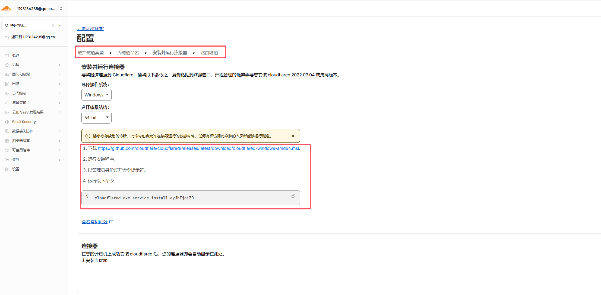
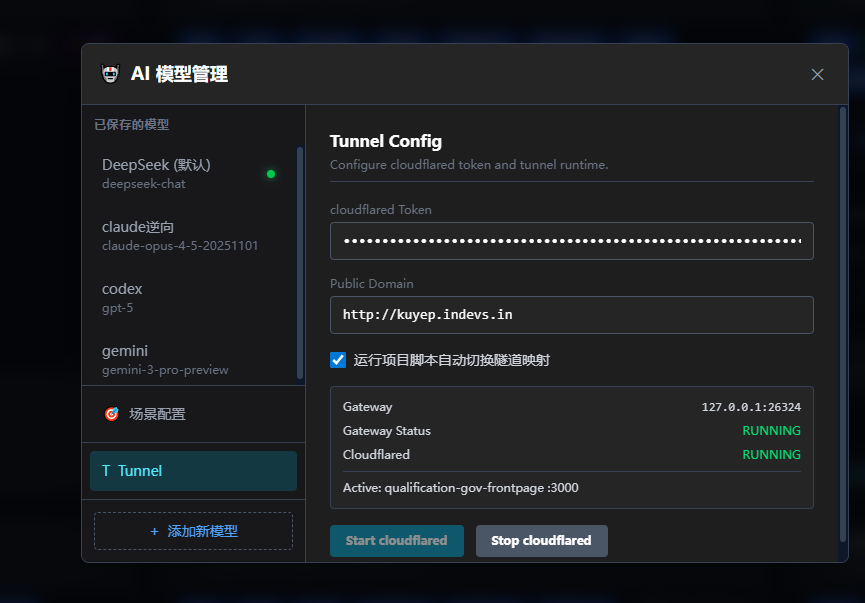

# Tunnel 使用教程

本文介绍如何在 `terminalManage` 中配置并使用 Cloudflare Tunnel，把本地开发服务安全暴露到公网。

## 1. 前提条件

在使用 terminalManage 的 Tunnel 功能前，需要先在 Cloudflare 完成以下准备：

1. 你的域名已接入并托管到 Cloudflare（DNS 可在 Cloudflare 管理）。
2. 在 Cloudflare Zero Trust 中创建 Tunnel，并获取 `cloudflared tunnel run token`。


3. 再为该 Tunnel 配置应用程序路由（Public Hostname），将域名绑定到本地网关。

推荐的路由配置方式：

- `Public Hostname`：填写你要对外访问的域名（如 `dev.example.com`）
- `Service Type`：`HTTP`
- `URL`：`http://127.0.0.1:26324`（terminalManage 内置 Tunnel 网关）

控制台路径参考（Cloudflare 后台）：

1. Cloudflare Dashboard -> 选择站点（域名）  
2. 进入 `Zero Trust`  
3. 进入 `Networks` -> `Tunnels`（部分账号界面可能显示为 `Access` -> `Tunnels`）  
4. 选择已创建 Tunnel，添加或编辑 `Public Hostname` 路由  

完成上述配置后，再回到 terminalManage 进行参数填写和启动。

## 2. 准备信息

开始前请先准备：

- `cloudflared tunnel run token`
- 对应的公网访问域名（Public Domain）


## 3. 在 terminalManage 中配置 Tunnel

打开右上角设置，进入 `Tunnel` 面板，填写以下内容：

- `cloudflared Token`
- `Public Domain`
- 可选开启：`运行项目脚本自动切换隧道映射`

填写完成后，点击 `Start cloudflared` 启动隧道。



## 4. 日常使用流程

1. 启动项目的 `dev` / `start` / `serve` 脚本。
2. 应用会根据项目配置和启动日志识别端口，并切换 Tunnel 目标项目。
3. 当 `cloudflared` 正在运行时，项目卡片会显示 `Tunnel URL`，点击即可访问公网地址。

## 5. 关闭与排查

- 临时关闭公网访问：点击 `Stop cloudflared`。
- 不希望自动切换：关闭 `运行项目脚本自动切换隧道映射`。

若未显示 `Tunnel URL`，请优先检查：

1. `cloudflared` 是否已成功启动。
2. Token 和 Public Domain 是否填写正确。
3. 项目脚本是否已成功运行并监听端口。

## 6. 相关说明

- 内置 Tunnel 网关地址：`127.0.0.1:26324`
- 配置存储于：`~/.terminalManage-config.json` 的 `ai_tunnel_config` 字段

## 7. 热更新注意事项（Vite / Webpack）

在 Tunnel 场景下，不同构建工具的 HMR 行为有明显差异：

- `Vite`：通常可以根据当前页面地址自动推导 HMR WebSocket 地址，开箱即用概率更高。
- `Webpack Dev Server`（含 Vue CLI）：默认 Host/Origin 校验更严格，且可能把 WS 地址注入为本机 IP，导致域名访问时热更新失败。

### Webpack 项目建议配置（Vue CLI 示例）

```js
// vue.config.js
module.exports = {
  devServer: {
    host: '0.0.0.0',
    port: 8081,
    allowedHosts: 'all',
    client: {
      webSocketURL: 'auto://0.0.0.0:0/ws',
      reconnect: 3
    }
  }
}
```

说明：

1. `allowedHosts: 'all'` 用于放行 tunnel 域名访问（避免 `Invalid Host/Origin header`）。
2. `webSocketURL: 'auto://0.0.0.0:0/ws'` 让 HMR WS 跟随当前访问域名，不写死本机 IP。
3. 如果浏览器里看到 WS 连接数量持续增加，通常是 HMR 重连循环，说明 WS 地址或 Host 校验仍有问题。

## 8. 常见问题 FAQ

### Q1: 点击 `Start cloudflared` 后无法启动，提示 token 相关错误

通常是 Token 无效、已过期，或复制时包含了多余空格。

建议按以下顺序检查：

1. 重新从 Cloudflare 控制台复制 `tunnel run token`，覆盖粘贴到设置面板。
2. 确认前后没有多余空格或换行。
3. 点击 `Stop cloudflared` 后再重新 `Start cloudflared`。
4. 如果仍失败，重新生成一份新的 token 再试。
5. 如果页面最新代码未生效需要开启cloudflare后台对应域名的缓存配置打开开发模式。

### Q2: Tunnel URL 能显示，但公网访问失败或 502/连接超时

通常是目标服务未成功启动、监听端口不对，或域名映射与当前 tunnel 配置不一致。

建议按以下顺序检查：

1. 本地先直接访问项目端口（如 `http://127.0.0.1:3000`）确认服务可用。
2. 确认 `Public Domain` 填写的是当前 tunnel 实际绑定的域名。
3. 查看项目日志里是否出现启动失败、端口占用、崩溃重启等错误。
4. 关闭并重启 cloudflared，再次验证 URL。

### Q3: 启动脚本后没有识别到端口，`Tunnel URL` 不显示

通常出现在脚本没有输出标准端口日志、端口启动较慢或项目使用了非常规启动方式。

建议按以下顺序检查：

1. 确认启动的是 `dev/start/serve` 这类常规脚本。
2. 等待几秒，观察日志中是否出现 `Local: http://...` 之类端口信息。
3. 检查项目是否实际已监听端口（可在终端中手动访问）。
4. 如项目端口固定，建议在项目脚本或环境变量中显式声明端口，提升识别稳定性。
